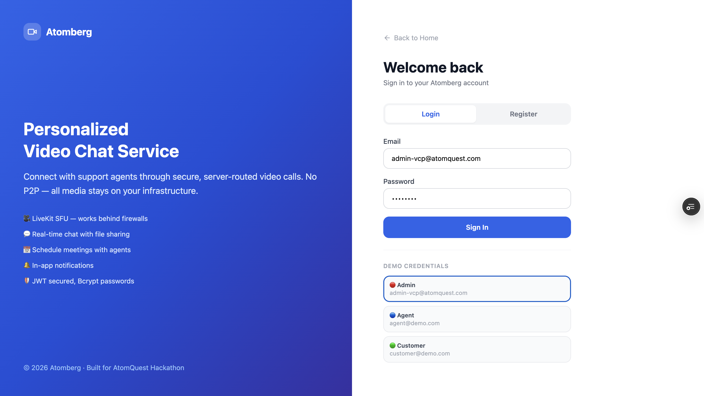

<div align="center">

# Atomberg
### Personalized Video Chat Service

A self-hosted video calling platform for customer support — agents create sessions, customers join via link, admins manage everything.

[](https://nextjs.org)
[](https://nestjs.com)
[](https://livekit.io)
[](https://postgresql.org)

**[Live Demo](https://atomquest-final.vercel.app)**

</div>

---

## What is Atomberg?

Atomberg is a **self-hosted video customer support platform**. Instead of peer-to-peer video (which fails behind firewalls), all media is routed through a **LiveKit SFU server** running on your own infrastructure — no third-party video service involved.

---

## Screenshots

### 🔐 Login Page



Clean split-screen login with clickable demo credentials. Backend runs on Render free tier — first load may take ~50 seconds to wake up.

---

### 🔵 Agent Dashboard


Agent's main overview — active sessions, waiting sessions, quick actions (New Session, Schedule, Notify).


Session History tab — full table of all sessions with status badges and actions.


Scheduled Sessions tab — upcoming meetings with customer assignment and cancel option.

---

### 🟢 Customer Dashboard


Hero section with stats — total sessions, active now, completed. Join a meeting by pasting the agent's link.


Session history cards — each session shows agent name, status badge, and Join Call button for active sessions.


Schedule a Meeting modal — customer submits topic, description, and preferred time. Request goes to admin for approval.

---

### 🔴 Admin Dashboard


Admin overview — live counts of total customers, agents, active meetings, and pending meeting requests.


Agents tab — verify pending agents (gives them the ✓ badge), delete unnecessary accounts.


Meeting Requests tab — approve or reject customer-submitted meeting requests with an optional note.


Admin Notifications — send messages to All Users, Agents Only, or Customers Only with type selection (Info, Warning, Success, Meeting).

---

### 🔔 Notification System


Bell icon in the navbar for every user — red badge shows unread count. Click to see notifications with sender name and relative time. Click a notification to mark it read.


Agent sending notifications — select individual customers or "Select All" for bulk, choose notification type, add title and message.


Admin sending notifications — broadcast to all users, agents only, or customers only from the admin panel.

---

### 🎥 Video Call Room


Live video call room — agent and customer connected via LiveKit SFU. Camera, mic controls, chat, recording, and share room link all available.


Full control bar — microphone toggle, camera toggle, chat panel, screen recording (⏺), and end call button.


In-call chat panel — real-time messaging with file sharing (images, video, audio, PDF) while on a live video call.


Screen recording — browser-native MediaRecorder captures the screen and auto-downloads as a `.webm` file. No server cost, completely free.

---

### 🏗️ System Design


System architecture — how frontend, backend, LiveKit SFU, PostgreSQL, Redis, and MinIO interact with each other.

---

## How It Works

```
1. Agent clicks "New Session"
        ↓
   Join link copied to clipboard
        ↓
2. Agent shares link with customer
        ↓
3. Customer opens link → logs in → joins room
        ↓
4. Both connect to LiveKit SFU server (NOT each other)
        ↓
5. LiveKit forwards video/audio between participants
        ↓
6. Agent ends call → session marked Ended
```

All video and audio stays on your server. Never browser-to-browser.

---

## User Roles

| Role | Access | Key Actions |
|------|--------|-------------|
| 🟢 **Customer** | `/sessions` | Join via link, schedule meeting requests, view history |
| 🔵 **Agent** | `/dashboard` | Create sessions, schedule future calls, send notifications |
| 🔴 **Admin** | `/admin` | Verify agents, manage users, approve meetings, send broadcasts |

---

## Demo Credentials

| Role | Email | Password |
|------|-------|----------|
| 🔴 Admin | `admin-vcp@atomquest.com` | `admin123` |
| 🔵 Agent | `agent@demo.com` | `password123` |
| 🟢 Customer | `customer@demo.com` | `password123` |

> On the login page, click any credential card to auto-fill the form.

---

## Quick Start (Local)

```bash
# 1. Start infrastructure
docker-compose up -d

# 2. Backend
cd backend && npm install && npm run start:dev

# 3. Frontend
cd frontend && npm install && npm run dev
```

Open **http://localhost:3000**

### Environment Variables

Copy the examples and fill in your values:
```bash
cp backend/.env.example backend/.env
cp frontend/.env.example frontend/.env.local
```

---

## Tech Stack

| | Technology | Purpose |
|---|---|---|
| 🖥️ | Next.js 14 + React | Frontend UI |
| ⚙️ | NestJS + TypeScript | Backend REST API |
| 🎥 | LiveKit SFU | Video & audio routing |
| 🗄️ | PostgreSQL (Neon) | Database |
| ⚡ | Redis (Upstash) | Presence & caching |
| 💬 | Socket.IO | Real-time chat |
| 📁 | MinIO | File storage |
| 📊 | Prometheus + Grafana | Metrics |

---

<div align="center">

**Atomberg** · Built for AtomQuest Hackathon · Self-hosted · Open Infrastructure

</div>
